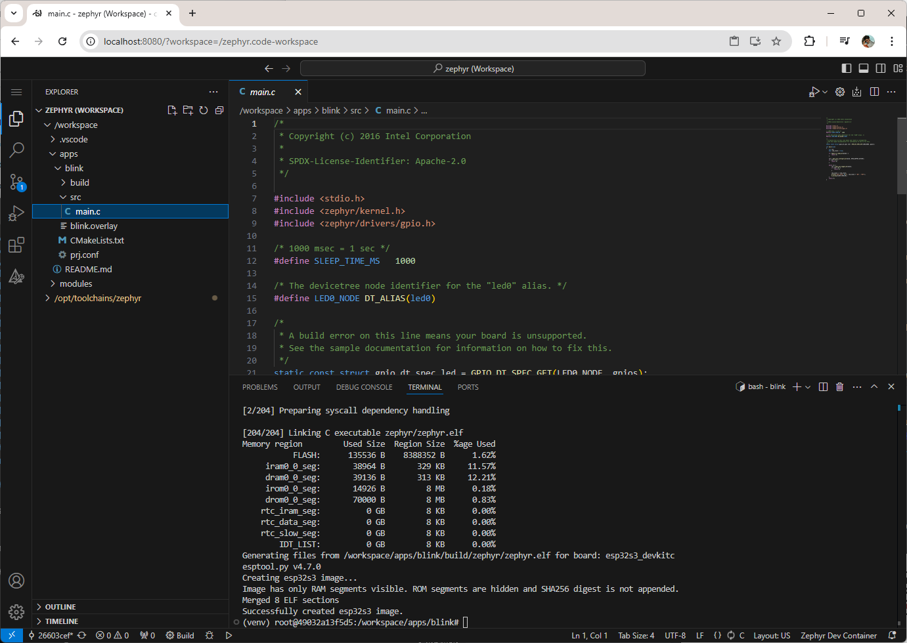

# VS Code Docker Environment for Zephyr

This is a development environment for creating Docker images with the Zephyr toolchain used to build source code for various embedded targets. You build the image for your desired toolchain, store projects in the *workspace/* directory, and then run the image whenever you want to build (e.g. `west build`) the project. Separate Dockerfiles exist for different target families (ARM, Espressif, etc.). The intention is to use this environment as your VS Code working directory, but it is usable outside of VS Code.



> **Note**: the instructions below were verified with Python 3.12 running on the host system. If one of the *pip install* steps fails, try installing exactly Python 3.12 and running the command again with `python3.12 -m pip install ...`

You have a few options for using this development environment:

 1. (Default) The container runs *code-server* so that you can connect to `localhost:8800` via a browser to get a pre-made VS Code instance
 2. Override the image's *entrypoint* to get an interactive shell to run editing programs (e.g. `vim`, `mcedit`) and build (e.g. `west build`)

## Getting Started

Before you start, install the following programs on your computer:

 * (Windows) [WSL 2](https://learn.microsoft.com/en-us/windows/wsl/install)
 * [Docker Desktop](https://www.docker.com/products/docker-desktop/)
 * [Python](https://www.python.org/downloads/)

Windows users will likely need to install the [virtual COM port (VCP) drivers from SiLabs](https://www.silabs.com/developers/usb-to-uart-bridge-vcp-drivers?tab=downloads).

Open a terminal, navigate to this directory, and install the following dependencies:

Linux/macOS:

```sh
python -m venv venv
source venv/bin/activate
python -m pip install pyserial==3.5
```

Windows (PowerShell):

```bat
Set-ExecutionPolicy -Scope CurrentUser -ExecutionPolicy Unrestricted -Force
python -m venv venv
venv\Scripts\activate
python -m pip install pyserial==3.5
```

Choose your desired target family below and follow the steps to build image and compile an example program.

### Espressif (ESP32)

From this directory, build the image (this will take some time):

```sh
docker build -t env-zephyr-espressif -f Dockerfile.espressif .
```

Run the image in *VS Code Server* mode. Note that it mounts the local *workspace/* directory into the container!

Linux/macOS:

```sh
docker run --rm -it -p 8080:8080 -v "$(pwd)"/workspace:/workspace -w /workspace env-zephyr-espressif
```

Windows (PowerShell):

```bat
docker run --rm -it -p 8800:8800 -v "${PWD}\workspace:/workspace" -w /workspace env-zephyr-espressif
```

Alternatively, you can run the image in interactive mode by adding the `--entrypoint /bin/bash` argument. This will allow you to skip running the VS Code server in the background.

Open a browser and navigate to http://localhost:8800/.

> **Important!** Take note of the two directories in your VS Code instance:
> * ***/workspace*** is the shared directory between your host and container.
> * ***/opt/toolchains/zephyr*** is the Zephyr RTOS source code. It is for reference only and should not be modified!

Open a terminal in the VS Code client and build the project. Note that I'm using the [ESP32-S3-DevKitC](https://docs.espressif.com/projects/esp-idf/en/stable/esp32s3/hw-reference/esp32s3/user-guide-devkitc-1.html) as my target board. Feel free to change it to one of the [other ESP32 dev boards](https://docs.zephyrproject.org/latest/boards/index.html#vendor=espressif).

```
cd apps/blink
west build -p always -b esp32s3_devkitc/esp32s3/procpu
```

With some luck, the *blink* sample should build. The binary files will be in *workspace/apps/blink/build/zephyr*, which you can flash using [esptool](https://docs.espressif.com/projects/esptool/en/latest/esp32/).

Connect a USB cable from your computer to the **UART port** on the development board. If you do not see the serial/COM port on your host OS, you might need to [install the necessary SiLabs VCP driver](https://www.silabs.com/developers/usb-to-uart-bridge-vcp-drivers?tab=downloads). In a new terminal on your **host computer**, activate the Python virtual environment (Linux/macOS: `source venv/bin/activate`, Windows: `venv\Scripts\activate`) if not done so already. Install the ESP flashing tool:

> **Important**: the following steps should be done on the **host computer** (not in the Docker container).

```sh
python -m pip install esptool==4.8.1
```

Flash the binary to your board. For some ESP32 boards, you need to put it into bootloader by holding the *BOOTSEL* button and pressing the *RESET* button (or cycling power). Change `<PORT>` to the serial port for your ESP32 board (e.g. `/dev/ttyS0` for Linux, `/dev/tty.usbserial-1420` for macOS, `COM7` for Windows). You might also need to install a serial port driver, depending on the particular board.

> **Important!** make sure to execute flashing and serial monitor programs from your **host OS** (not from within the Docker container)

```sh
python -m esptool --port "<PORT>" --chip auto --baud 921600 --before default_reset --after hard_reset write_flash -u --flash_mode keep --flash_freq 40m --flash_size detect 0x0 workspace/apps/blink/build/zephyr/zephyr.bin
```

> **Important**: If you are using Linux and get a `Permission denied` or `Port doesn't exist` error when flashing, you likely need to add your user to the *dialout* group with the following command: `sudo usermod -a -G dialout $USER`. Log out and log back in (or restart). You should then be able to call the *esptool* command again to flash the firmware.

Open a serial port for debugging. Change `<PORT>` to the serial port for your ESP32 board.

```sh
python -m serial.tools.miniterm "<PORT>" 115200
```

You should see the LED state printed to the console. Exit with *ctrl+]* (or *cmd+]* for macOS).

## License

All software in this repository, unless otherwise noted, is licensed under the [Apache-2.0](https://www.apache.org/licenses/LICENSE-2.0) license.
